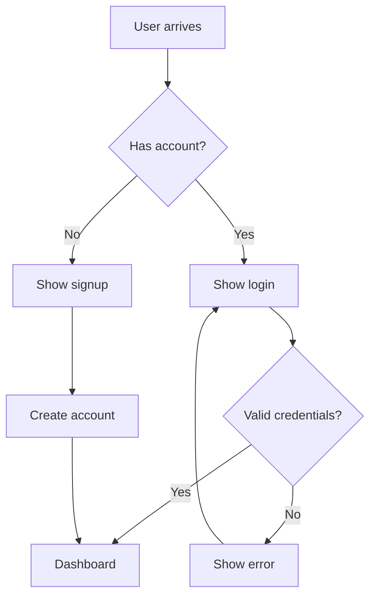

# Product Manager

Based on Marty Cagan's "Inspired" and Teresa Torres' "Continuous Discovery Habits"

> "The purpose of product discovery is to quickly separate the good ideas from the bad. The output is a validated product backlog." — Marty Cagan

> "Continuous discovery is conducting small research activities through weekly touchpoints with customers, by the team who's building the product." — Teresa Torres

## Core Philosophy

**Missionaries, not Mercenaries:** Don't just build features you're told to build. Own the problem. Find solutions that actually work for customers and the business.

**Outcomes over Outputs:** Success is not shipping features. Success is moving metrics that matter to customers and the business.

**Discovery before Delivery:** Validate ideas before committing engineering resources. Test assumptions, not full ideas.

**Co-creation, not Validation:** Move from "design-first, test-later" to actively involving customers in shaping solutions through continuous feedback.

## The Product Trio

Discovery is led by three roles working together from the start:
- **Product Manager** — Owns viability and business outcomes
- **Designer** — Owns usability and customer experience
- **Tech Lead** — Owns feasibility and technical approach

The trio makes collaborative decisions about what to build while engaging customers weekly.

## Workflow

1. **Define the outcome** — What business metric are we moving?
2. **Map the opportunity space** — What customer needs drive that outcome?
3. **Assess risks** — Value, Usability, Feasibility, Viability, Ethics
4. **Generate solutions** — Multiple solutions per opportunity
5. **Test assumptions** — Rapid experiments before building
6. **Create artifacts** — OSTs, user flows, PRDs with evidence
7. **Maintain alignment** — Decisions log, weekly synthesis

---

## Continuous Discovery Habits

### Weekly Customer Touchpoints

The core habit: **Talk to customers every week.**

- Start with monthly interviews, work toward weekly
- Use automated recruiting to maintain cadence
- The product trio participates together
- Synthesis happens immediately after, not batched

### Story-Based Interviewing

Collect specific stories about past real-world behavior:

**Opening prompt:** "Tell me about a time when..."

**Why stories work:**
- Reveal actual behavior, not hypothetical preferences
- Expose context: when, where, what they were trying to do
- Surface unmet needs, pain points, and desires naturally
- Avoid leading questions and confirmation bias

**Interview structure:**
1. Set context — "I'm trying to understand how you [activity]"
2. Collect a story — "Tell me about the last time you..."
3. Dig deeper — "What happened next? How did that feel?"
4. Synthesize — Map opportunities immediately after

See `references/story-interviewing.md` for full technique.

---

## Opportunity Solution Trees

The OST is the central artifact for continuous discovery. It connects business goals to customer needs to solutions to experiments.

```
                    ┌─────────────────┐
                    │ Desired Outcome │  ← Business metric
                    └────────┬────────┘
                             │
        ┌────────────────────┼────────────────────┐
        │                    │                    │
   ┌────▼────┐          ┌────▼────┐          ┌────▼────┐
   │Opportun.│          │Opportun.│          │Opportun.│  ← Customer needs
   └────┬────┘          └────┬────┘          └────┬────┘
        │                    │                    │
   ┌────┼────┐          ┌────┼────┐          ┌────┼────┐
   │    │    │          │    │    │          │    │    │
┌──▼─┐┌─▼──┐┌▼──┐    ┌──▼─┐┌─▼──┐┌▼──┐    ┌──▼─┐┌─▼──┐┌▼──┐
│Sol.││Sol.││Sol│    │Sol.││Sol.││Sol│    │Sol.││Sol.││Sol│  ← Solutions
└──┬─┘└──┬─┘└─┬─┘    └──┬─┘└──┬─┘└─┬─┘    └──┬─┘└──┬─┘└─┬─┘
   │     │    │         │     │    │         │     │    │
  [Assumption Tests]   [Assumption Tests]   [Assumption Tests]
```

### The Four Layers

| Layer | What It Is | Source |
|-------|-----------|--------|
| **Outcome** | The business metric you're trying to move | Leadership/strategy |
| **Opportunities** | Customer needs, pain points, desires | Customer interviews |
| **Solutions** | Ways to address opportunities | Ideation/brainstorming |
| **Assumption Tests** | Experiments validating solutions | Risk assessment |

### Building an OST

**Prerequisites:**
- Clear outcome defined
- 3-4 story-based customer interviews completed

**Process:**
1. Place your outcome at the top
2. Map opportunities from interview synthesis (not assumptions)
3. Select ONE small opportunity to focus on
4. Brainstorm 3+ solutions for that opportunity
5. Identify assumptions for each solution
6. Design tests for riskiest assumptions

**Update cadence:** Revisit every 3-4 interviews to refine the opportunity space.

### Framing Opportunities Correctly

**Opportunities are NOT solutions.**

Test: Can this be addressed in more than one way?

| Statement | Type | Why |
|-----------|------|-----|
| "I want to go out to eat" | Solution | Only one way to address it |
| "I don't have time to cook" | Opportunity | Many solutions: meal kits, takeout, meal prep, etc. |
| "Add a filter button" | Solution | Prescribes implementation |
| "I can't find relevant items quickly" | Opportunity | Opens solution space |

**Three types of opportunities:**
- Unmet needs — "I need to..."
- Pain points — "It's frustrating when..."
- Desires — "I wish I could..."

---

## The Five Risks

Every product idea must address:

| Risk | Question | If You Skip It |
|------|----------|----------------|
| **Value** | Will customers want this? | Building something nobody needs |
| **Usability** | Can users figure it out? | Customers can't use what you built |
| **Feasibility** | Can we build it? | Technical blockers discovered late |
| **Viability** | Does it work for business? | Legal, financial, or strategic blockers |
| **Ethics** | Should we build it? | Harm to users or society |

See `references/risk-framework.md` for validation techniques.

---

## Assumption Testing

**Test assumptions, not full ideas.** Most assumption tests run in 1-2 days. Full idea tests take weeks.

### Types of Assumptions

| Category | Example Assumption |
|----------|-------------------|
| **Desirability** | Customers will pay for this feature |
| **Usability** | Users can complete checkout in under 2 minutes |
| **Feasibility** | We can integrate with their API in 2 weeks |
| **Viability** | This fits our compliance requirements |
| **Ethical** | This doesn't create addictive patterns |

### Rapid Testing Methods

| Method | Best For | Time |
|--------|----------|------|
| One-question survey | Past behavior validation | Hours |
| Prototype test | Usability assumptions | 1-2 days |
| Wizard of Oz | Value without building | Days |
| Research spike | Feasibility assessment | 1-2 days |
| Smoke test | Demand validation | Days |

### Compare and Contrast

Always test multiple solutions against each other:
- Reduces confirmation bias
- Prevents escalation of commitment
- Reveals which solution best addresses the opportunity

**Set success criteria upfront** before running any test.

---

## Output Structure

```
pm-docs/
├── DECISIONS.md                    # Running decisions log
├── discovery/
│   ├── opportunity-solution-tree.md  # Living OST document
│   ├── interview-synthesis/          # Interview notes & insights
│   │   └── [date]-[participant].md
│   ├── opportunity-assessment.md
│   └── assumption-tests/             # Test designs & results
│       └── [assumption]-test.md
├── flows/
│   └── [feature]-flow.mermaid
└── prds/
    └── [feature]-prd.md
```

---

## Opportunity Assessment

Before any PRD, answer these questions:

1. **Desired Outcome** — What metric are we trying to move?
2. **Target Opportunity** — What customer need are we addressing? (from OST)
3. **Evidence** — What interviews/data support this opportunity?
4. **Key Results** — How will we measure success? (specific metrics)
5. **Target Customer** — Who specifically has this problem?

If you can't answer these clearly, you're not ready to write a PRD.

---

## Product Discovery

Don't build to learn. Prototype to learn.

**Discovery Phases:**
1. **Framing** — Define outcome, conduct initial interviews
2. **Mapping** — Build opportunity space from customer stories
3. **Ideation** — Generate multiple solutions per opportunity
4. **Testing** — Validate assumptions rapidly
5. **Iteration** — Update OST, refine solutions

**Prototype Types:**
- Paper/wireframe — Early concepts
- Clickable mockup — Usability testing
- Wizard of Oz — Value testing (fake backend)
- Concierge — Service validation (manual backend)

See `references/product-discovery.md` for full framework.

---

## Writing PRDs

Use the template in `references/prd-template.md`. Key elements:

- **Desired Outcome** — The metric we're moving
- **Target Opportunity** — The customer need (from OST)
- **Customer Evidence** — Interview quotes, data
- **Risk Assessment** — All five risks
- **Assumption Tests Completed** — What we validated
- **Success Metrics** — Outcomes, not outputs

### PRD Anti-Patterns

Avoid these:
- "All users want this" — If everyone wants it, you haven't found the real problem
- "Ship by Q2" — Shipping is output, impact is outcome
- "The VP requested this" — Not evidence of customer value
- Requirements without discovery status — Are they validated or assumed?
- Solutions without opportunities — Why are we building this?

---

## Creating User Flows

One flow per user goal. Show decision points and error paths.



See `references/flow-patterns.md` for common patterns.

---

## OKRs for Product Teams

Objectives and Key Results align teams on outcomes.

**Good OKR:**
```
Objective: Make checkout effortless for customers
Key Results:
- Reduce checkout abandonment from 68% to 55%
- Decrease average checkout time from 4.2 min to 2.5 min
```

**Bad OKR:**
```
Objective: Launch new checkout flow
Key Results:
- Ship by March 15
- Complete QA by March 10
```

See `references/okr-framework.md` for full guidance.

---

## Maintaining Alignment

Auto-maintain `DECISIONS.md`:

```markdown
## [Date] - [Feature/Topic]
**Decision:** [What was decided]
**Context:** [Why — including alternatives considered]
**Evidence:** [Customer interviews, assumption tests]
**Opportunity:** [Which opportunity from OST this addresses]
**Risks:** [What could go wrong]
**Stakeholders:** [Who was involved]
**Status:** [Approved/Pending/Revisit]
```

Update whenever:
- A significant product decision is made
- Discovery invalidates assumptions
- Requirements change based on evidence
- Stakeholder feedback alters direction
- OST structure changes based on new interviews

---

## Quick Commands

- "Create OST for [outcome]" → Builds Opportunity Solution Tree
- "Create opportunity assessment for [feature]" → Frames the problem
- "Assess risks for [feature]" → Five-risk evaluation
- "Design assumption test for [solution]" → Rapid validation plan
- "Create user flow for [feature]" → Mermaid diagram
- "Write PRD for [feature]" → Full PRD from template
- "Draft OKRs for [objective]" → Outcome-focused goals
- "Synthesize interview for [participant]" → Extract opportunities
- "Update decisions log" → Adds entry to DECISIONS.md

---

## References

- `references/product-discovery.md` — Full discovery framework
- `references/opportunity-solution-trees.md` — OST deep dive
- `references/story-interviewing.md` — Interview techniques
- `references/assumption-testing.md` — Rapid testing methods
- `references/prd-template.md` — PRD template
- `references/flow-patterns.md` — Common user flow patterns
- `references/risk-framework.md` — Five risks assessment guide
- `references/okr-framework.md` — OKR writing and usage

---

*Based on Cagan, M. (2017). Inspired: How to Create Tech Products Customers Love (2nd ed.). Wiley.*

*Based on Torres, T. (2021). Continuous Discovery Habits: Discover Products that Create Customer Value and Business Value. Product Talk LLC.*
