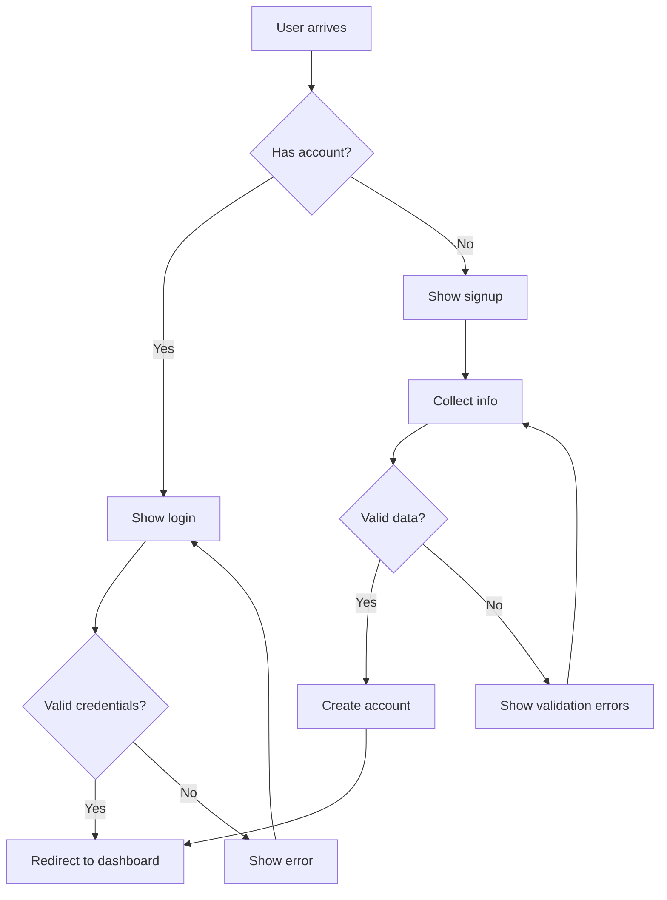
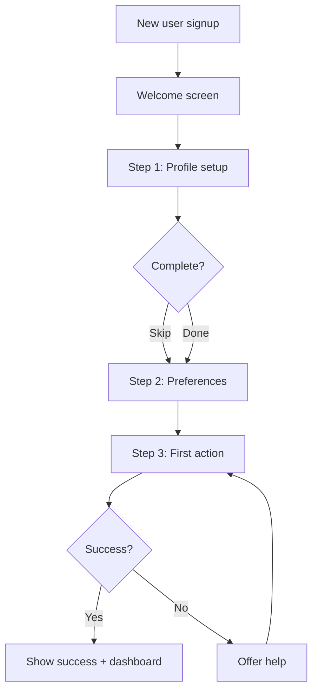
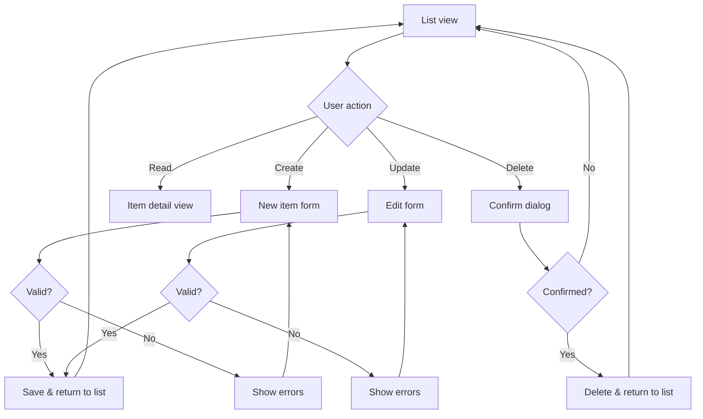
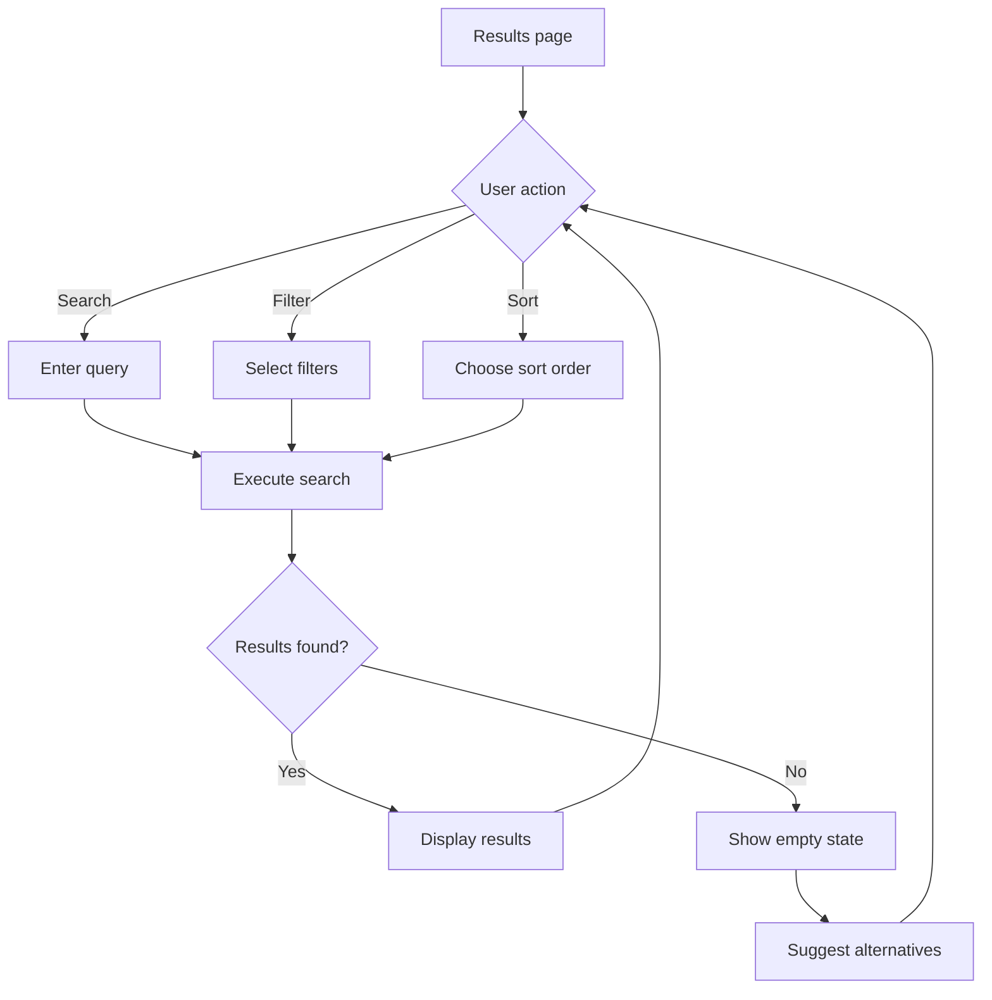
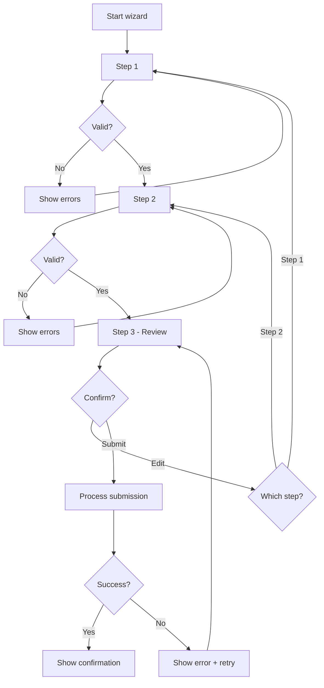
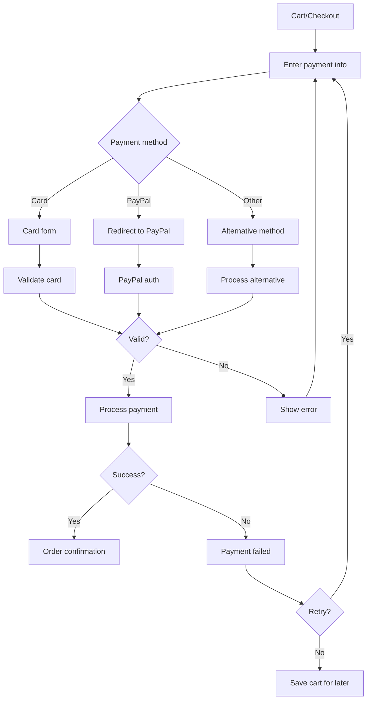
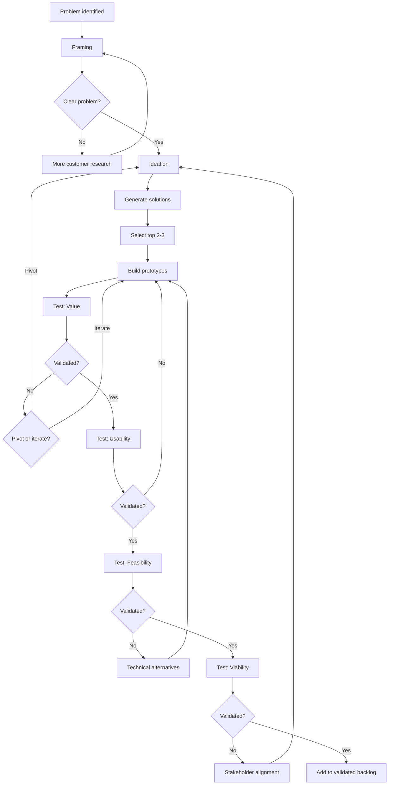
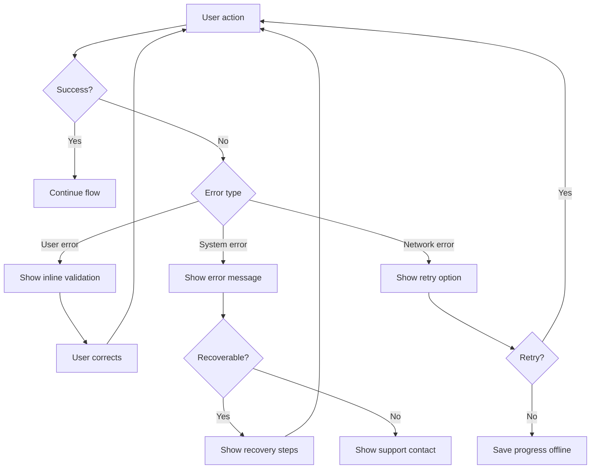

# User Flow Patterns

Common flow patterns for product documentation using Mermaid diagrams.

## Core Principles

1. **One flow per user goal** — Don't cram everything into one diagram
2. **Show decision points** — Where does the user make choices?
3. **Include error paths** — What happens when things go wrong?
4. **Label with user intent** — Use action verbs from the user's perspective

---

## Pattern 1: Authentication Flow



## Pattern 2: Onboarding Flow



## Pattern 3: CRUD Operations



## Pattern 4: Search & Filter



## Pattern 5: Multi-step Form (Wizard)



## Pattern 6: Payment Flow



## Pattern 7: Feature Discovery (Inspired)

Use this pattern to map the discovery process itself:



## Pattern 8: Error Recovery



---

## Diagram Tips

### Do
- Start with the user's goal at the top
- Use clear, action-oriented labels
- Show what happens on failure
- Keep it to one page when possible
- Use consistent shapes (rectangles for actions, diamonds for decisions)

### Don't
- Mix multiple user journeys in one diagram
- Include implementation details
- Forget error states
- Make it so complex it needs a legend

### Mermaid Syntax Quick Reference

```
flowchart TD          # Top-down direction (or LR for left-right)
A[Rectangle]          # Standard node
B{Diamond}            # Decision point
C([Stadium])          # Start/end state
D[(Database)]         # Data store
A --> B               # Arrow
A -->|Label| B        # Arrow with label
A -.-> B              # Dotted arrow
A ==> B               # Thick arrow
```

---

*Use these patterns as starting points. Adapt them to your specific user journey.*
