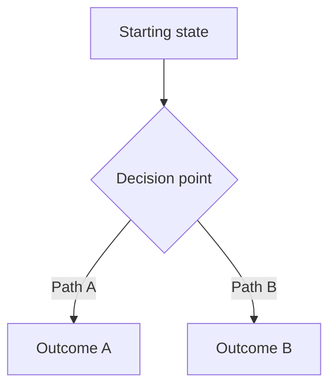

# PRD Template (Inspired Framework)

Based on Marty Cagan's product discovery principles. This template ensures PRDs capture evidence, not assumptions.

---

# [Feature Name] PRD

**Author:** [Name]
**Date:** [Date]
**Status:** Draft | In Review | Approved
**Discovery Status:** Not Started | In Progress | Validated

---

## 1. Problem Statement

### The Problem
[Describe the customer problem in their language. What pain are they experiencing?]

### Evidence
[How do we know this is a real problem? Include:]
- Customer interview quotes
- Support ticket data
- Analytics showing drop-off/friction
- Competitive pressure

### Who Has This Problem
[Target customer segment. Be specific:]
- User persona/type
- Job to be done
- Current workaround they use

> **Anti-pattern:** "All users want this" — If everyone wants it, you haven't found the real problem yet.

---

## 2. Opportunity Assessment

Answer these four questions (Cagan's Opportunity Assessment):

| Question | Answer |
|----------|--------|
| **Business Objective** | What company goal does this support? |
| **Key Results** | How will we measure success? (Specific metrics) |
| **Customer Problem** | What pain are we solving? (From their perspective) |
| **Target Customer** | Who specifically has this problem? |

---

## 3. Risk Assessment

Rate each risk: **Low | Medium | High | Unknown**

| Risk | Rating | Evidence/Notes |
|------|--------|----------------|
| **Value Risk** — Will customers want this? | | |
| **Usability Risk** — Can they figure it out? | | |
| **Feasibility Risk** — Can we build it? | | |
| **Viability Risk** — Does it work for business? | | |

### Risks to Mitigate in Discovery
[List specific unknowns that must be validated before building]

---

## 4. Solution Hypothesis

> **Note:** This is a hypothesis to test, not a spec to build.

### Proposed Approach
[High-level solution direction]

### Why This Approach
[Reasoning, alternatives considered]

### User Flow
[Link to Mermaid diagram or embed below]

---

## 5. Discovery Plan

### Prototypes to Build
| Prototype | Type | Risk Addressed | Timeline |
|-----------|------|----------------|----------|
| | Wireframe / Clickable / Wizard of Oz | | |

### Tests to Run
| Test | Method | Success Criteria | Participants |
|------|--------|------------------|--------------|
| Value test | [Interview / Fake door / etc.] | | |
| Usability test | | | |
| Feasibility assessment | | | |

### Discovery Timeline
[When will discovery be complete? What decisions depend on it?]

---

## 6. User Stories

Use the standard format, but add acceptance criteria focused on outcomes:

### Story 1: [Title]
**As a** [user type]
**I want to** [action]
**So that** [outcome/benefit]

**Acceptance Criteria:**
- [ ] [Testable condition]
- [ ] [Testable condition]

**Value Evidence:** [Link to discovery findings]

---

## 7. Requirements

### Functional Requirements
| ID | Requirement | Priority | Discovery Status |
|----|-------------|----------|------------------|
| FR-1 | | Must Have / Should Have / Nice to Have | Validated / Testing / Assumed |

### Non-Functional Requirements
| ID | Requirement | Constraint |
|----|-------------|------------|
| NFR-1 | Performance | |
| NFR-2 | Security | |
| NFR-3 | Accessibility | |

---

## 8. Success Metrics

Define outcomes, not outputs:

| Metric | Current State | Target | Measurement Method |
|--------|---------------|--------|-------------------|
| | | | |

> **Anti-pattern:** "Ship by Q2" — Shipping is output. Impact is outcome.

---

## 9. Stakeholder Sign-off

### Viability Review
| Stakeholder | Concern Area | Status | Notes |
|-------------|--------------|--------|-------|
| Legal | Compliance | Pending / Approved | |
| Finance | Revenue impact | | |
| Marketing | Go-to-market | | |
| Sales | Customer impact | | |
| Security | Data/risk | | |

---

## 10. Open Questions

| Question | Owner | Due Date | Status |
|----------|-------|----------|--------|
| | | | Open / Answered |

---

## 11. Decision Log

| Date | Decision | Rationale | Decider |
|------|----------|-----------|---------|
| | | | |

---

## Appendix

### A. Discovery Artifacts
- Customer interview recordings/notes
- Prototype links
- Test results
- Analytics screenshots

### B. Alternatives Considered
[Document solutions you explicitly chose NOT to pursue and why]

### C. Dependencies
[Other teams, systems, or initiatives this depends on]

---

*Template based on Marty Cagan's Inspired framework. Key principle: Validate before you build.*
